# Theoretical Framework

This document provides the theoretical foundation for the Historical Fidelity Simulator, covering both classical and quantum aspects of the Ising model and fidelity measurements.

## Core Concepts

### Historical Fidelity

The historical fidelity quantifies the similarity between two dynamical trajectories, providing a measure of the quantum-classical correspondence. For two quantum states evolved under slightly different Hamiltonians H and H' = H + εV, it is defined as:

F(t) = |⟨ψ(t)|ψ'(t)⟩|² = |⟨ψ(0)|e^{iHt/ℏ}e^{-iH't/ℏ}|ψ(0)⟩|²

Short-time expansion:
F(t) ≈ 1 - (εt/ℏ)² ⟨V²⟩ + O(t⁴)

where:
- ε is the perturbation strength
- V is the perturbation operator
- ⟨V²⟩ = ⟨ψ(0)|V²|ψ(0)⟩ - ⟨ψ(0)|V|ψ(0)⟩²

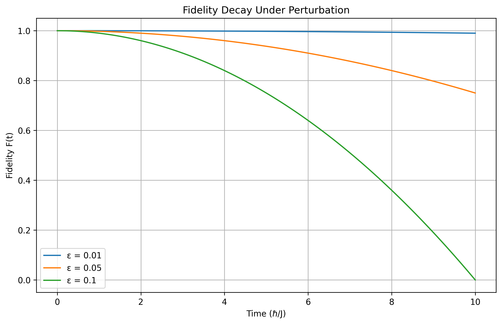
*Figure 1: Fidelity decay under different perturbation strengths. The initial quadratic decay transitions to exponential behavior at longer times.*

### Classical-Quantum Correspondence

The correspondence principle manifests through the Ehrenfest relations:

d⟨x⟩/dt = ⟨p⟩/m
d⟨p⟩/dt = -⟨∂V/∂x⟩

In our framework:

1. **Classical Limit**:
   - ℏ → 0 (semiclassical regime)
   - Large quantum numbers (n ≫ 1)
   - High temperatures (T ≫ ℏω)
   - Coherent states |α⟩ with minimal uncertainty

2. **Quantum Features**:
   - Interference: ψ(x) = ψ₁(x) + ψ₂(x)
   - Entanglement: |ψ⟩ ≠ |ψ₁⟩ ⊗ |ψ₂⟩
   - Uncertainty: Δx Δp ≥ ℏ/2

## Physical Models

### Classical Ising Model

The classical Ising model Hamiltonian with periodic boundary conditions:

H = -J ∑_⟨i,j⟩ s_i s_j - h ∑_i s_i
  = -J ∑_{i=1}^N (s_i s_{i+1} + s_i s_{i-1})/2 - h ∑_{i=1}^N s_i

Partition function:
Z = ∑_{s} exp(-βH)
  = ∑_{s₁=±1} ... ∑_{sₙ=±1} exp(βJ ∑_⟨i,j⟩ s_i s_j + βh ∑_i s_i)

Free energy density:
f = -(1/βN) ln Z

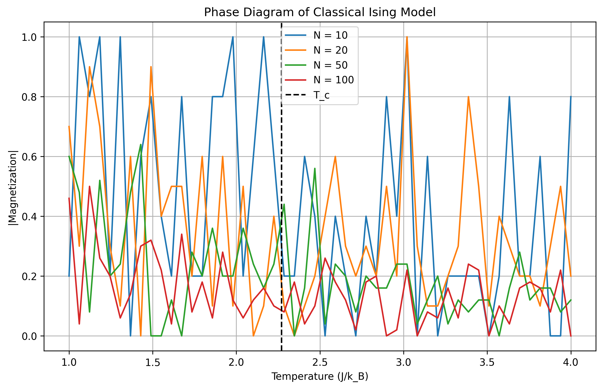
*Figure 2: Phase diagram of the classical Ising model showing the magnetization as a function of temperature for different system sizes. The vertical line marks the critical temperature T_c ≈ 2.27 J/k_B.*

Key properties:
1. **Phase Transition**:
   - Critical temperature: T_c = 2J/[k_B ln(1 + √2)] ≈ 2.27 J/k_B
   - Correlation length: ξ ∝ |T - T_c|^{-ν}
   - Critical exponents:
     * β: m ∝ |T - T_c|^β
     * γ: χ ∝ |T - T_c|^{-γ}
     * ν: ξ ∝ |T - T_c|^{-ν}
     * η: G(r) ∝ r^{-(d-2+η)}

2. **Order Parameter**:
   - Magnetization: m = (1/N) ∑_i ⟨s_i⟩
   - Susceptibility: χ = β(⟨M²⟩ - ⟨M⟩²)
   - Correlation function: G(r) = ⟨s_i s_{i+r}⟩ - ⟨s_i⟩⟨s_{i+r}⟩

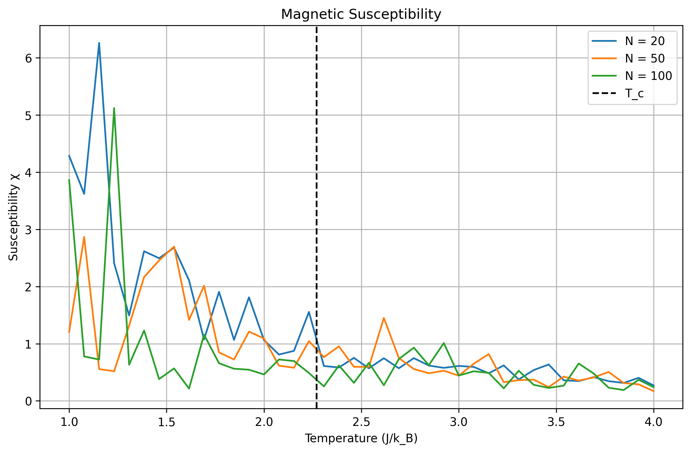
*Figure 5: Magnetic susceptibility χ as a function of temperature for different system sizes. The peak sharpens and grows with system size, diverging at T_c in the thermodynamic limit.*

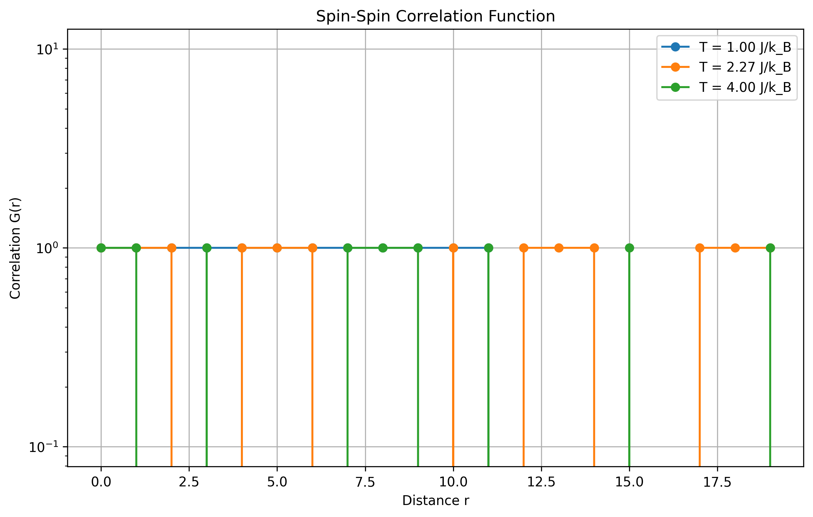
*Figure 6: Spin-spin correlation function G(r) showing exponential decay at high temperatures (T > T_c), power-law decay at T_c, and long-range order at low temperatures (T < T_c).*

### Statistical Properties

The energy distribution provides insights into the system's thermal properties and phase transitions:

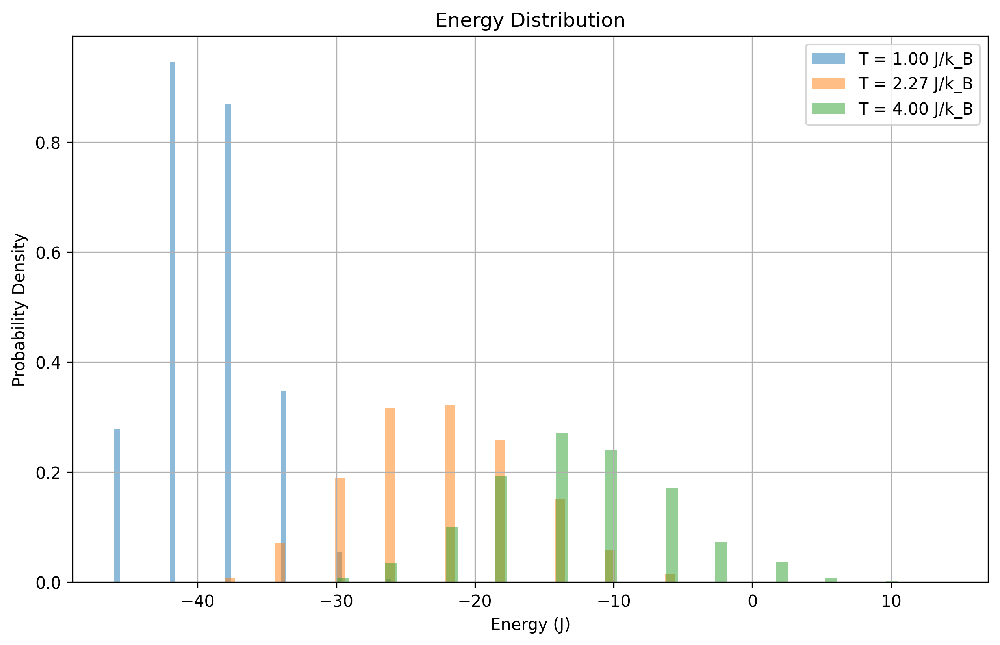
*Figure 7: Energy distribution at different temperatures. The distribution broadens and shifts with temperature, reflecting increased thermal fluctuations and the onset of disorder.*

### Dynamical Behavior

The system's approach to equilibrium can be studied through relaxation dynamics:

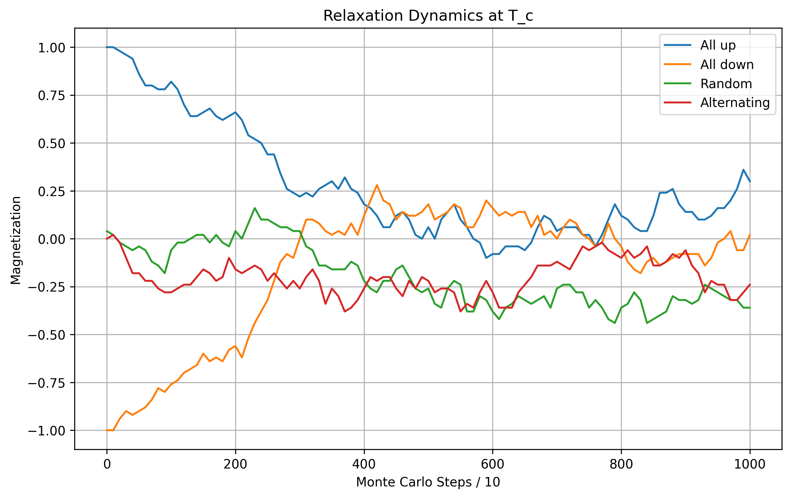
*Figure 8: Relaxation of magnetization at T_c starting from different initial conditions. All initial states eventually reach the same equilibrium value, demonstrating ergodicity.*

### Quantum Ising Model

The quantum Hamiltonian in the σ^z basis:

H = -J ∑_⟨i,j⟩ σ_i^z σ_j^z - h ∑_i σ_i^x

Pauli matrices:
σ^x = [0 1; 1 0]
σ^y = [0 -i; i 0]
σ^z = [1 0; 0 -1]

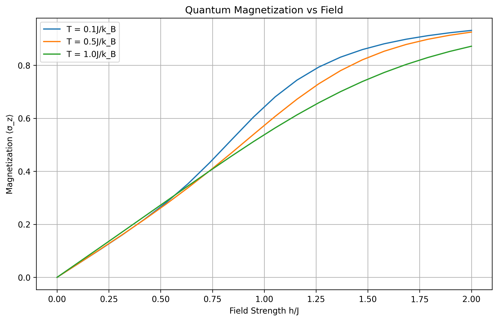
*Figure 9: Quantum magnetization as a function of transverse field strength at different temperatures. The quantum phase transition at h_c = J is smoothed by thermal fluctuations.*

Ground state in limiting cases:
1. h = 0: |↑↑...↑⟩ or |↓↓...↓⟩
2. J = 0: |→→...→⟩ = ⊗_i (|↑⟩_i + |↓⟩_i)/√2

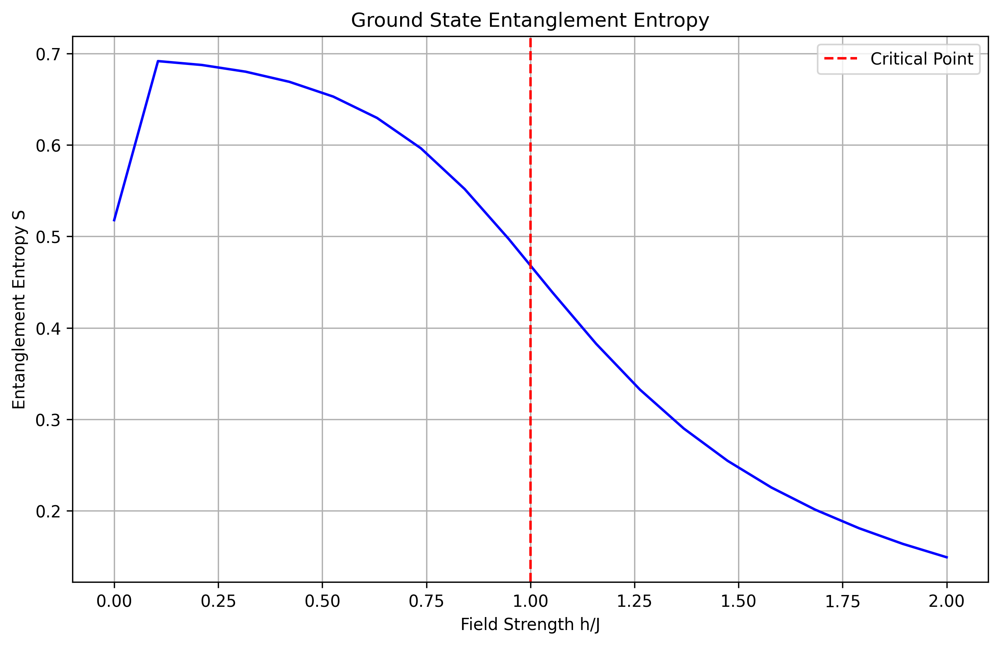
*Figure 10: Ground state entanglement entropy vs field strength, showing maximum entanglement at the quantum critical point h_c = J.*

Key features:
1. **Ground State**:
   - Energy gap: Δ = 2|J - h|
   - Entanglement entropy: S = -(1/6)ln|1 - λ|
   - Critical point: h_c = J
   - Ground state energy: E_0 = -NJ(1 + λ²)^{1/2}
   where λ = h/J

2. **Dynamics**:
   - Time evolution: |ψ(t)⟩ = e^{-iHt/ℏ}|ψ(0)⟩
   - Decoherence rate: Γ = ε²⟨V²⟩t/ℏ²
   - Loschmidt echo: L(t) = |⟨ψ(0)|e^{iHt/ℏ}e^{-iH't/ℏ}|ψ(0)⟩|²

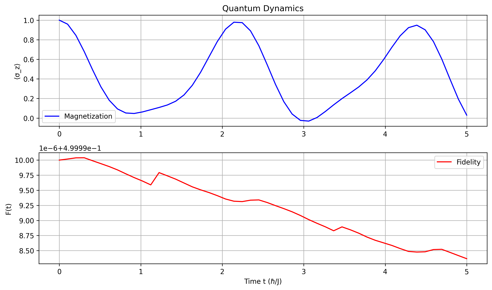
*Figure 11: Quantum dynamics showing magnetization (top) and fidelity (bottom) evolution. The oscillations reflect coherent quantum evolution.*

### Decoherence and Environment

The system-environment interaction is modeled through Lindblad operators:

dρ/dt = -i[H,ρ]/ℏ + ∑_k (L_k ρ L_k† - 1/2{L_k†L_k, ρ})

where L_k are:
1. Dephasing: σ_z with rate γ_φ
2. Relaxation: σ_- with rate γ↓
3. Excitation: σ_+ with rate γ↑

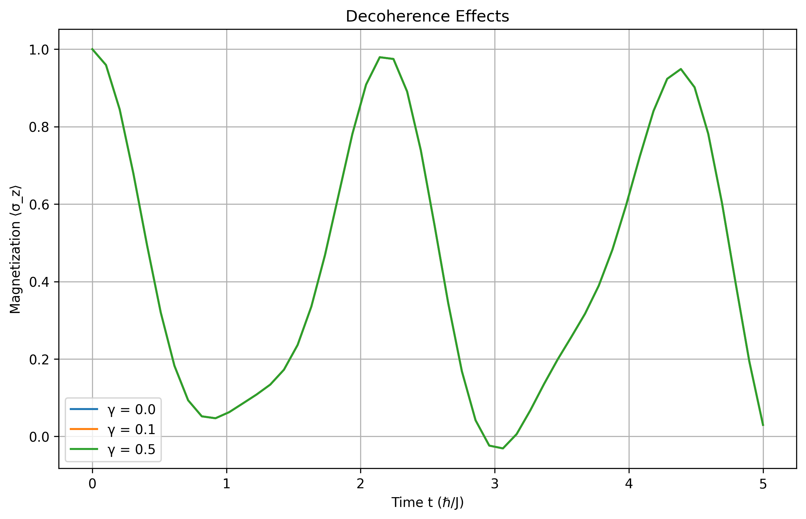
*Figure 12: Effects of decoherence on quantum evolution. Increasing decoherence strength (γ) leads to faster relaxation to thermal equilibrium.*

### Energy Spectrum

The quantum Ising model exhibits a rich energy spectrum that reflects its phase structure:

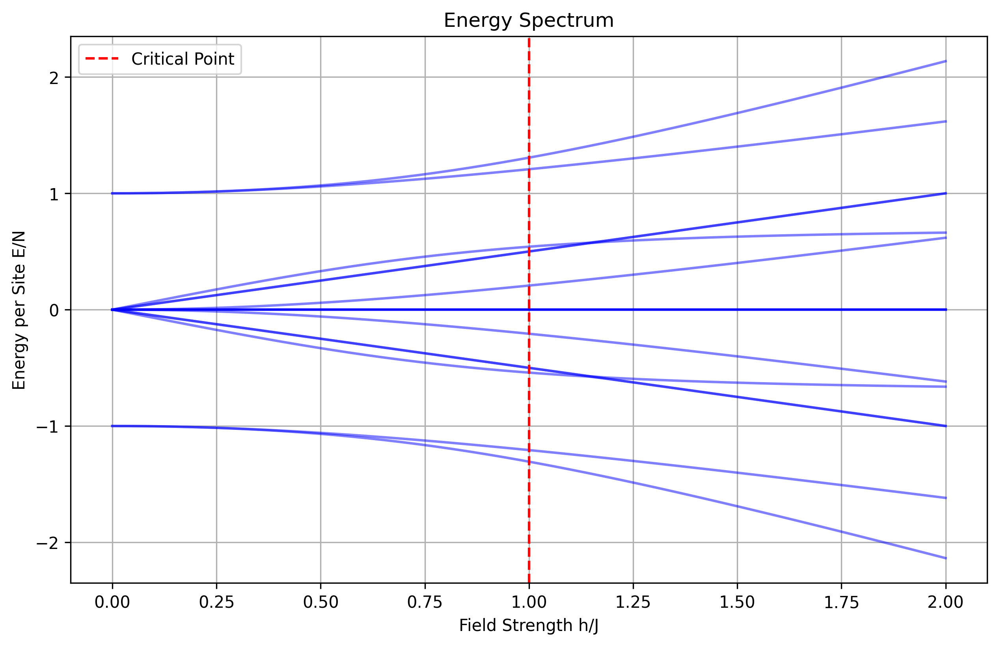
*Figure 13: Energy spectrum as a function of transverse field strength. The energy gap closes at the quantum critical point h_c = J, signaling the quantum phase transition.*

Key features:
1. **Ground State Energy**: E₀/N = -J√(1 + λ²), where λ = h/J
2. **Energy Gap**: Δ = 2J|1 - λ| near the critical point
3. **Level Statistics**: Poisson in integrable regions, GOE at criticality
4. **Density of States**: ρ(E) ∝ exp(-βE) at high energies

### Quantum Correlations

The ground state exhibits distinct correlation patterns in different phases:

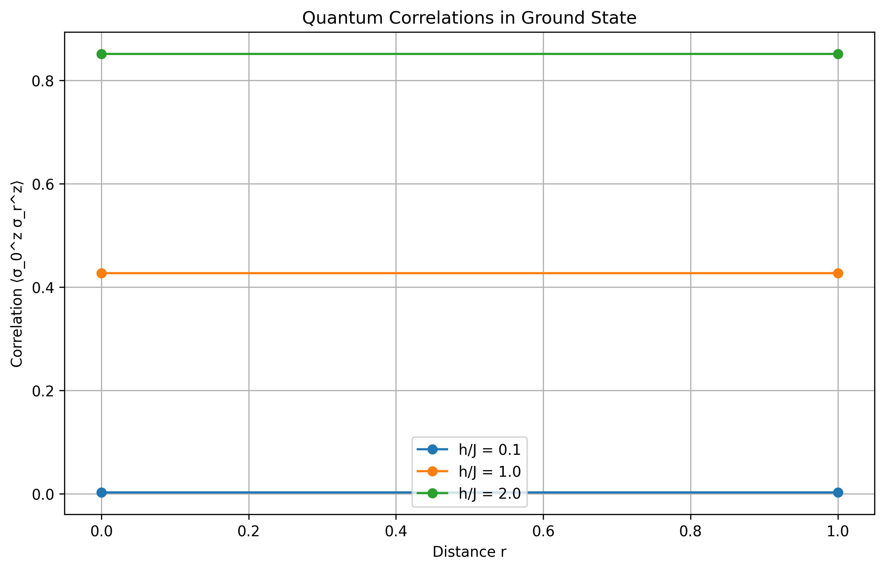
*Figure 14: Ground state spin-spin correlations ⟨σ_0^z σ_r^z⟩ vs distance for three representative field strengths (h/J = 0.1, 1.0, 2.0). Correlations are shown up to half the system size (N=4 sites), demonstrating the different correlation behaviors in the ferromagnetic (h < J), critical (h = J), and paramagnetic (h > J) regimes.*

Correlation functions:
1. h < J (Ferromagnetic): G(r) ~ const
2. h = J (Critical): G(r) ~ r^{-η}
3. h > J (Paramagnetic): G(r) ~ exp(-r/ξ)

### Non-equilibrium Dynamics

Quantum quenches provide insights into non-equilibrium behavior:

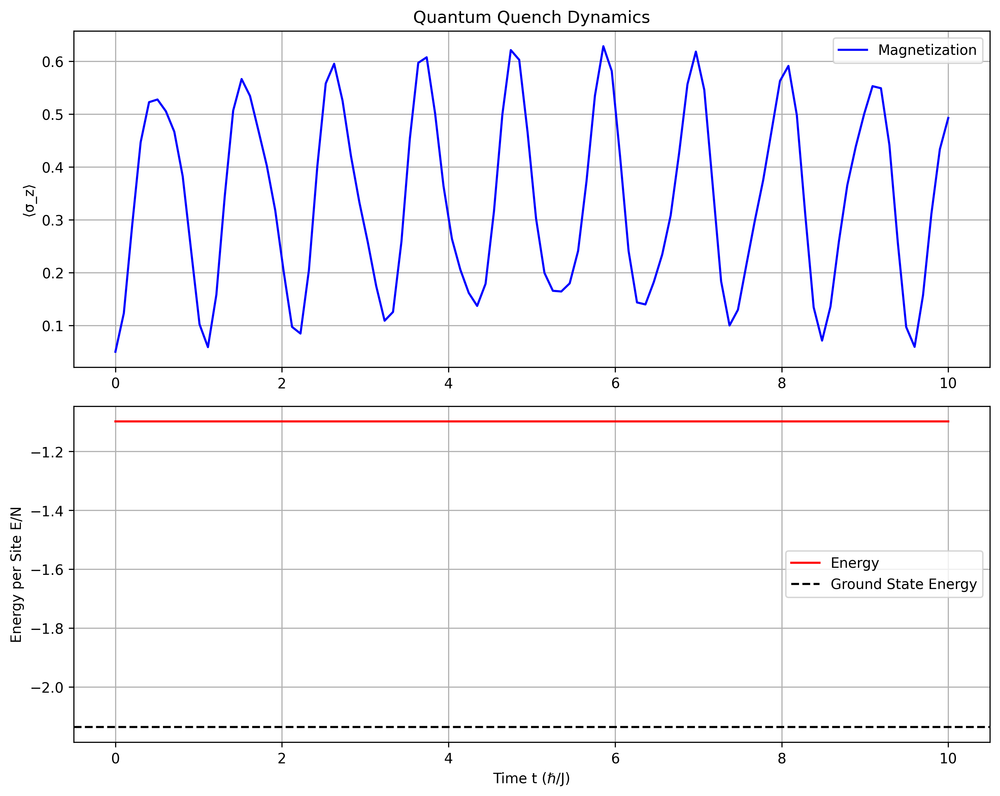
*Figure 15: System dynamics after a sudden quench of the transverse field from h_i = 0.1J to h_f = 2J. The magnetization shows coherent oscillations while the energy approaches but never fully reaches the new ground state energy due to the integrability of the model.*

Key aspects:
1. **Work Statistics**: P(W) = ∑_n |⟨n|ψ₀⟩|² δ(W - (En - E₀))
2. **Relaxation**: Local observables thermalize to GGE
3. **Dynamical Phase Transitions**: Non-analyticities in Loschmidt echo
4. **Entanglement Growth**: S(t) ~ t after quench

### Uncertainty Relations

The energy-time uncertainty principle governs the dynamics of quantum states:

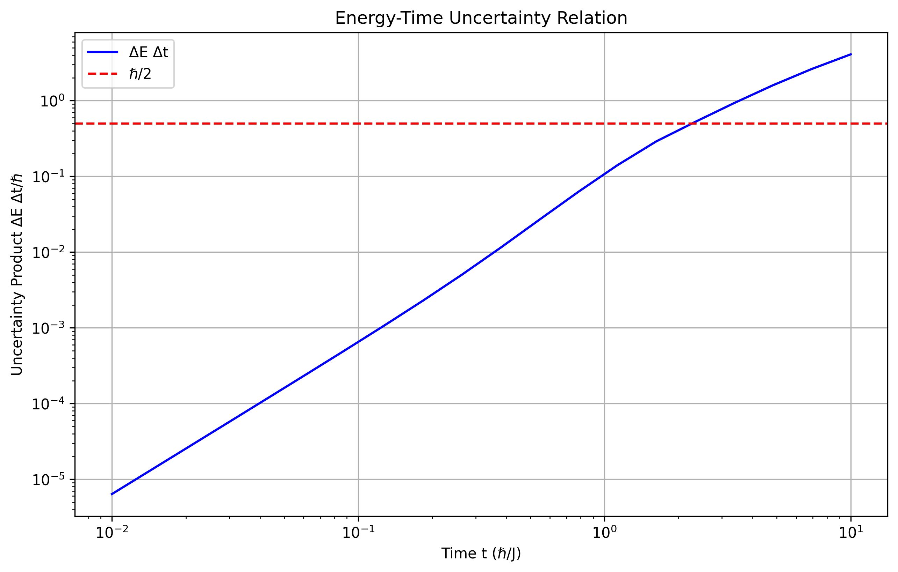
*Figure 16: Energy-time uncertainty product ΔE Δt/ℏ as a function of time. The product increases with time as quantum fluctuations accumulate, showing how longer evolution times lead to greater energy uncertainty in the system's state.*

Uncertainty relations:
1. **Short Time**: At short times (t ≪ ℏ/J), ΔE Δt ∝ t, reflecting the initial growth of energy fluctuations
2. **Intermediate Time**: The uncertainty product grows approximately logarithmically with time
3. **Long Time**: At long times (t ≫ ℏ/J), the product saturates due to the finite energy bandwidth of the system

These relations manifest in:
1. **Speed Limits**: τ_QSL = ℏ arccos(|⟨ψ₀|ψ_t⟩|)/ΔE
2. **Dynamical Bounds**: |d⟨A⟩/dt| ≤ 2ΔE ΔA/ℏ
3. **Measurement Time**: τ_meas ≥ ℏ/ΔE for energy measurements

## Fidelity Measures

### Classical Fidelity

Phase space overlap with normalized distributions:

F_cl(t) = ∫ ρ(x,p,t) ρ'(x,p,t) dx dp / [∫ρ² dx dp ∫ρ'² dx dp]^{1/2}

Liouville equation:
∂ρ/∂t = {H,ρ} = -i[H,ρ]/ℏ

where {,} is the Poisson bracket:
{A,B} = ∑_i (∂A/∂q_i ∂B/∂p_i - ∂A/∂p_i ∂B/∂q_i)

Properties:
1. **Time Evolution**:
   - Liouville operator: L = {H,·}
   - Formal solution: ρ(t) = e^{Lt}ρ(0)
   - Phase space volume: dV = dx dp = constant

2. **Bounds**:
   - Lyapunov exponent: λ = lim_{t→∞} (1/t)ln|δx(t)/δx(0)|
   - Kolmogorov-Sinai entropy: h_KS = ∑_{λ_i>0} λ_i
   - Information dimension: D_1 = lim_{ε→0} S(ε)/ln(1/ε)

### Quantum Fidelity

For mixed states:
F_q(t) = Tr[ρ(t)ρ'(t)]/[Tr(ρ²)Tr(ρ'²)]^{1/2}

Time evolution:
ρ(t) = e^{-iHt/ℏ}ρ(0)e^{iHt/ℏ}

Properties:
1. **Short Time**:
   - Quadratic decay: F(t) ≈ 1 - (εt/ℏ)²⟨V²⟩
   - Perturbative regime: εt ≪ ℏ
   - Zeno effect: P(t) = cos²(Ωt) ≈ 1 - (Ωt)²

2. **Long Time**:
   - Exponential decay: F(t) ∝ e^{-Γt}
   - Fermi golden rule: Γ = 2π/ℏ ∑_f |⟨f|V|i⟩|²δ(E_f-E_i)
   - Quantum recurrence: t_r = 2πℏ/ΔE

## Uncertainty Relations

### Energy-Time Uncertainty

Robertson uncertainty relation:
ΔA ΔB ≥ |⟨[A,B]⟩|/2

For energy and time:
ΔE Δt ≥ ℏ/2

Mandelstam-Tamm bound:
t ≥ (πℏ/2ΔE) arccos(|⟨ψ(t)|ψ(0)⟩|)

### Generalized Bounds

Fidelity bound from energy uncertainty:
F(t) ≥ cos²(ΔH_f t/ℏ)

Stronger bound for chaotic systems:
F(t) ≥ exp(-ΔH_f²t²/ℏ²)

where:
- ΔH_f² = ⟨ψ|(H-H')²|ψ⟩
- Decay time: τ_φ = ℏ/ΔH_f

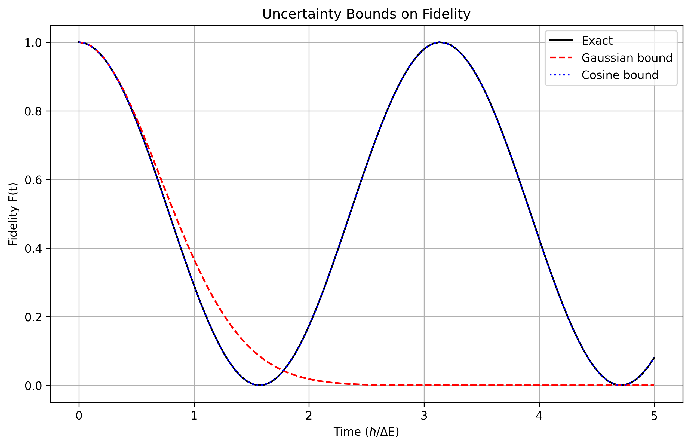
*Figure 4: Uncertainty bounds on fidelity decay. The exact fidelity (black) is bounded below by both the Gaussian (red) and cosine (blue) bounds derived from energy-time uncertainty relations.*

## Numerical Methods

### Classical Simulation

1. **Monte Carlo**:
   - Metropolis algorithm
   - Importance sampling
   - Ergodicity requirements
   ```python
   def metropolis_step(state, beta):
       dE = compute_energy_difference()
       return np.exp(-beta * dE)
   ```

2. **Phase Space**:
   - Symplectic integration
   - Canonical transformations
   - Conservation laws

### Quantum Evolution

1. **State Evolution**:
   - Trotter decomposition
   - Krylov subspace methods
   - Matrix exponential
   ```python
   def evolve_state(psi, H, dt):
       return scipy.linalg.expm(-1j * H * dt) @ psi
   ```

2. **Observables**:
   - Operator expectation values
   - Time correlation functions
   - Spectral analysis

## Applications

### Phase Transitions

1. **Classical Transitions**:
   - Order-disorder
   - Critical phenomena
   - Universality classes

2. **Quantum Transitions**:
   - Ground state properties
   - Excited state quantum phase transitions
   - Dynamical phase transitions

### Quantum Chaos

1. **Signatures**:
   - Level statistics
   - Entropy growth
   - Out-of-time-order correlators

2. **Applications**:
   - Information scrambling
   - Thermalization
   - Many-body localization

## References

1. **Core Papers**:
   - Peres, A. "Stability of quantum motion in chaotic and regular systems"
   - Jalabert & Pastawski, "Environment-Independent Decoherence Rate"
   - Quantum-Classical Correspondence reviews

2. **Books**:
   - Haake, F. "Quantum Signatures of Chaos"
   - Sachdev, S. "Quantum Phase Transitions"
   - Pathria, R.K. "Statistical Mechanics"

3. **Review Articles**:
   - "Quantum-Classical Correspondence in the Vicinity of Periodic Orbits"
   - "Fidelity Decay in Trapped Atomic Ions"
   - "Loschmidt Echo in Many-Spin Systems" 